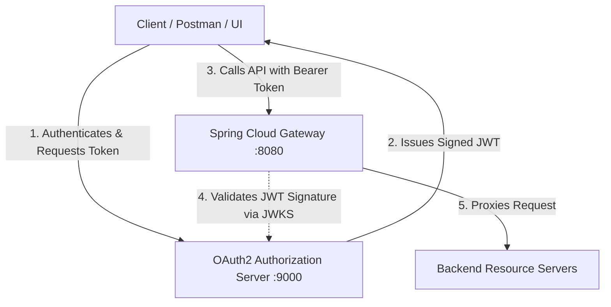

# OAuth2 Authorization Server (`spring-6-auth-server`)

> **Course Project:** Built as part of a hands-on microservices ecosystem following John Thompson's *Spring Framework 6 / Spring Boot 3* course.

## Overview

The `spring-6-auth-server` microservice acts as the dedicated **OAuth2 Authorization Server** for the Brewery ecosystem. Running on port `9000`, it manages user authentication, issues signed JSON Web Tokens (JWTs), and provides JWK (JSON Web Key) sets so downstream services can verify token signatures.

It centralizes identity management across the API Gateway and backend Resource Servers.

## Key Features

* **OAuth2 / OIDC Compliant:** Built on `spring-boot-starter-oauth2-authorization-server` to handle standard authorization grant flows (client credentials, authorization code).
* **JWT Token Issuance:** Generates and signs JWT tokens using RSA key pairs.
* **JWK Set Endpoint:** Exposes `/.well-known/jwks.json` for downstream microservices to fetch public keys and validate incoming tokens locally.
* **Custom Security Configurations:** Configured user stores, client registrations, and granted authorities/scopes for the system.

## Role in Architecture



## Tech Stack & Dependencies

* **Java Version:** 17
* **Framework:** Spring Boot 3
* **Security:** Spring Security, Spring Authorization Server (`spring-boot-starter-oauth2-authorization-server`)
* **Build Tool:** Maven

## Configuration & Ports

The server runs on port `9000` by default as configured in `src/main/resources/application.yml`:

```yaml
server:
  port: 9000

spring:
  security:
    oauth2:
      authorizationserver:
        client:
          messaging-client:
            registration:
              client-id: messaging-client
              client-secret: "{noop}secret"
              authorization-grant-types:
                - "authorization_code"
                - "refresh_token"
                - "client_credentials"
              redirect-uris:
                - "[https://oauth.pstmn.io/v1/callback](https://oauth.pstmn.io/v1/callback)"
              scopes:
                - "openid"
                - "message.read"
                - "message.write"

```

## Getting Started

### Prerequisites

1. Java 17+

### Running Locally

```bash
# Clone the repository
git clone [https://github.com/JandierR/spring-6-auth-server.git](https://github.com/JandierR/spring-6-auth-server.git)
cd spring-6-auth-server

# Run the authorization server
./mvnw spring-boot:run

```

Once running, verify the server is active by accessing the OpenID discovery endpoint:
`http://localhost:9000/.well-known/openid-configuration`

## Testing

Run unit and integration tests using Maven:

```bash
./mvnw test

```
